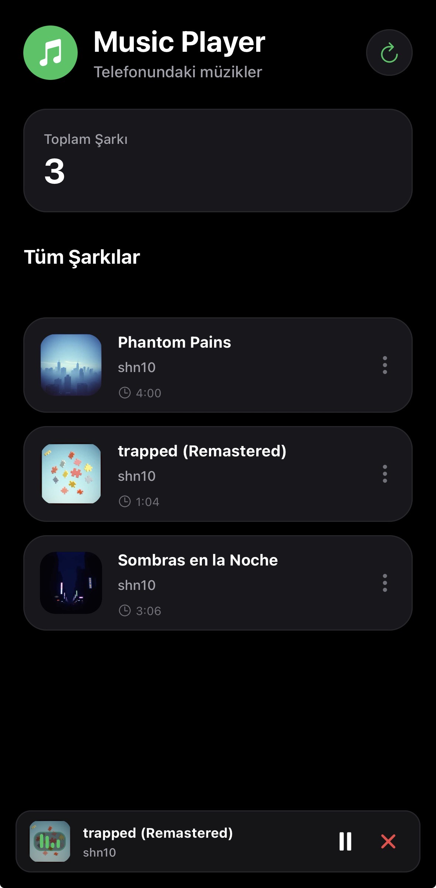
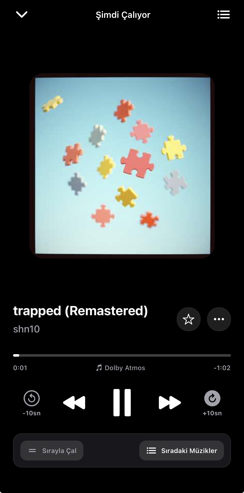

# 🎵 ReactNativeCLI_MusicPlayer

<p align="center">
  
  
  
  
  
</p>

---

## 📱 Screenshots

<p align="center">
  
  &nbsp;&nbsp;&nbsp;&nbsp;
  
</p>

---

## 📖 About the Project

**ReactNativeCLI_MusicPlayer** is a high-performance mobile music player built entirely with **pure React Native CLI (`@react-native-community/cli`)**—without Expo—following **SOLID software architecture principles**. It plays local MP3 files, provides uninterrupted background audio playback and lockscreen controls, and features a sleek, modern user interface inspired by **YouTube Music**.

---

## ⚡ Why React Native CLI (Bare Native)?

This project deliberately avoids third-party wrappers like Expo in favor of a **Bare React Native CLI** architecture:
* 🎧 **Direct Native Audio Engine Access:** Unrestricted integration with iOS `AVPlayer` and Android `ExoPlayer`.
* 📱 **Hardware Lockscreen & Control Center:** Native `MediaSession` integration with live artwork, time scrubbers, and remote controls.
* 📂 **Direct Native Filesystem Bridging:** High-performance local storage indexing via iOS Files app and Android Storage.
* ⚙️ **Custom Native Pipelines:** Direct CocoaPods (`Podfile`) and Android Gradle configuration for production-grade builds.

---

## ✨ Key Features

* 🎧 **Background Audio & Lockscreen Playback:** Continues playing smoothly when the app is minimized or the screen is locked. Full playback controls available in the Control Center and Lockscreen.
* 🌓 **Automatic Real-Time Dark / Light Mode:** Seamlessly reacts to the phone's system appearance changes in real time without manual toggle buttons or app restarts.
* 🎚️ **YouTube Music Style Dynamic Progress Bar:**
  * Interactive finger scrubbing with live elapsed and remaining countdown timers.
  * Instant duration re-scaling across track transitions (automatically adapts between 1-minute and 4-minute songs).
* 📂 **Memory-Optimized Local File Scanner:** Scans audio files in batches of 4 to prevent memory watermark spikes (`EXC_RESOURCE`) on iOS.
* 🌐 **Automatic Multi-Language Localization:**
  * Detects device system language out-of-the-box:
  * 🇹🇷 **Turkish** | 🇬🇧 **English** | 🇪🇸 **Spanish** | 🇩🇪 **German** | 🇫🇷 **French** | 🇸🇦 **Arabic**
* ⚡ **Floating Mini Player:** Persistent bottom player bar featuring an animated equalizer overlay when audio is active.
* 🔁 **Playback Modes:** Sequential Play, Shuffle, and Repeat Single Track.

---

## 🛠️ Tech Stack

| Category | Technology / Library | Description |
| :--- | :--- | :--- |
| **Framework / CLI** | [React Native CLI 0.86](https://reactnative.dev/) | Pure native CLI architecture (No Expo) |
| **Language** | [TypeScript 5.8](https://www.typescriptlang.org/) | Strict type safety |
| **Styling & UI** | [NativeWind v4](https://www.nativewind.dev/) & TailwindCSS | Reactive theme tokens and clean design system |
| **Audio Engine** | [react-native-track-player](https://react-native-track-player.js.org/) | Background audio service and lockscreen controls |
| **File System** | [@dr.pogodin/react-native-fs](https://github.com/dr-pogodin/react-native-fs) | Local file scanning and directory access |
| **Metadata** | [@missingcore/audio-metadata](https://github.com/missingcore/audio-metadata) | ID3 tag extraction (artist, artwork, title) |
| **Icons** | [react-native-vector-icons (Ionicons)](https://github.com/oblador/react-native-vector-icons) | Vector icon set |
| **Testing** | [Jest](https://jestjs.io/) | Unit tests and strategy pattern tests |

---

## 🏛️ SOLID Architecture Principles

The codebase is strictly structured according to enterprise **SOLID** standards:

* **S (Single Responsibility):** File scanning (`FileScannerService`), duration extraction (`AudioMetadataService`), audio playback (`TrackPlayerAudioService`), playlist queue management (`QueueManager`), and localization (`LocalizationService`) are encapsulated in single-purpose classes.
* **O (Open / Closed):** Playback modes (`SequentialStrategy`, `ShuffleStrategy`, `RepeatStrategy`) implement the extensible `IPlaybackStrategy` interface.
* **L & I (Liskov & Interface Segregation):** Segregated interfaces (`IAudioPlayer`, `IMusicScanner`, `IMetadataExtractor`) allow seamless substitution and test mocking.
* **D (Dependency Inversion):** React Context providers and custom hooks depend on abstract contracts rather than concrete implementations.

---

## 📁 Where to Put MP3 Files?

The app automatically generates a dedicated **`MusicFiles`** directory on your device. To load your tracks:

### 🍏 iOS (iPhone & iPad):
1. Open the **Files** app on your iPhone.
2. Navigate to **"On My iPhone"**.
3. Open the **`MusicPlayer`** app folder and paste your `.mp3` files inside the **`MusicFiles`** folder (you can also transfer files directly via AirDrop, Mac Finder, or iTunes File Sharing).
4. Tap the **Refresh** button in the top-right corner of the app to scan and list all tracks.

### 🤖 Android:
1. Open your device's **Files / File Manager** app.
2. Place your `.mp3` files in the **`MusicFiles`** folder located in the root of your Internal Storage.
3. Open the app, and tracks will be automatically scanned and listed on the home screen.

---

## 🧪 Platform Compatibility & Test Status

* 🍏 **iOS:** Fully tested and verified on physical iPhone hardware and iOS Simulators (Background playback, lockscreen, theme switching, file scanning, and scrubber mechanics).
* 🤖 **Android:** Android architecture, manifest permissions, foreground playback services (`FOREGROUND_SERVICE_MEDIA_PLAYBACK`), and adaptive icons are completely configured; **not yet tested end-to-end on a physical Android device.**

---

## 🚀 Getting Started

### 1. Clone the Repository & Install Dependencies:
```bash
git clone https://github.com/omerfshan/ReactNativeCLI_MusicPlayer.git
cd ReactNativeCLI_MusicPlayer
npm install
```

### 2. iOS CocoaPods Setup:
```bash
cd ios
bundle install
bundle exec pod install
cd ..
```

### 3. Run the Application:
```bash
# Terminal 1: Start the Metro Bundler
npm start

# Terminal 2: Run the app
npm run ios     # For iOS
npm run android # For Android
```

---

## 🧪 Running Unit Tests
```bash
npm test
```

---

## 📄 License
This project is open source and available under the [MIT License](LICENSE).
